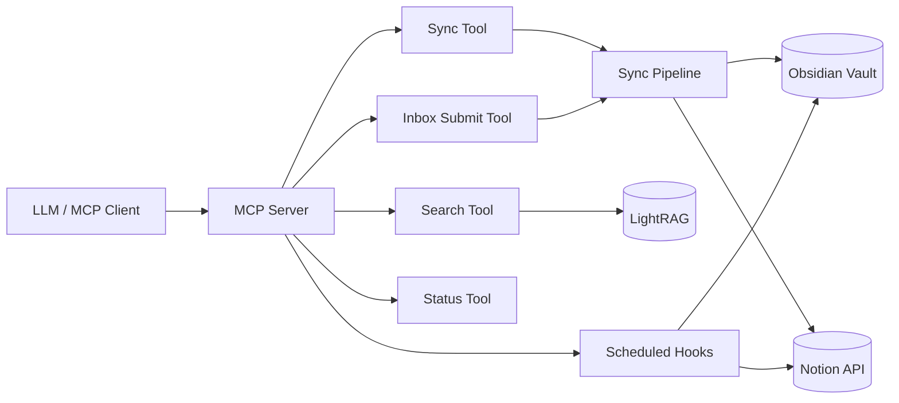

# Hermes Memory Provider

Hermes Memory Provider turns the Phase 1–14 memory pipeline into a deployable Python package for Obsidian-backed memory storage. It keeps the vault authoritative, routes every new entry through `inbox/`, and exposes sync/search/status tools through MCP. LightRAG, Notion, and embedding backends are optional integrations rather than hard requirements for basic vault operation.

## 1. 프로젝트 소개

- Obsidian 볼트를 SSoT로 유지하는 memory provider입니다.
- 신규 entry는 항상 `inbox/`를 먼저 거친 뒤 분류되면 `knowledge/`로 승격됩니다.
- MCP server, deployment doctor, scheduled hooks, optional Notion/LightRAG integration을 함께 제공합니다.

## 2. 아키텍처 다이어그램



## 3. Quick Start

### 방법 A. LLM에게 맡기기
1. 이 저장소와 `SETUP_PROMPT.md`를 같은 위치에 둡니다.
2. LLM에게 `SETUP_PROMPT.md`를 읽히고 설치를 맡깁니다.
3. LLM이 물어보는 값 중 확실한 것만 답하고, 모르는 값은 기본값/나중 설정으로 진행합니다.

### 방법 B. 직접 설치
```bash
bash setup.sh
```

`setup.sh`는 Python 확인 → editable install → `lightrag-hku` 설치 → LightRAG 임베딩 선택(OpenAI API vs 로컬) → Notion DB URL 입력 시 실제 Notion 속성 목록 조회/선택(`HERMES_SETUP_NOTION_SYNC_SELECTION`로 비대화식 전달 가능) → `config.yaml`/`.env` 생성 → 볼트 폴더와 `data/lightrag_store/` 준비 → 선택 시 LightRAG 기동 → `hermes-memory-doctor` 실행까지 처리합니다.

LightRAG 임베딩 선택지는 다음과 같습니다.
- **OpenAI API (`text-embedding-3-small`)**: API 키만 있으면 바로 사용 가능, 품질이 좋고 기본값입니다.
- **로컬 모델 (`sentence-transformers/all-MiniLM-L6-v2`)**: API 키가 필요 없고 오프라인 구성이 가능하지만, 첫 실행 시 모델 다운로드가 일어날 수 있습니다.

### 방법 C. 수동 설치
```bash
python -m pip install -e ".[dev]"
python -m pip install -e ".[embedding-api]"      # OpenAI API 임베딩 사용 시
python -m pip install -e ".[embedding-local]"    # 로컬 임베딩 사용 시
python -m pip install lightrag-hku
mkdir -p data/lightrag_store
cp config.example.yaml config.yaml
cp env.example .env
hermes-memory-doctor --config ./config.yaml
python -m plugins.memory.hermes_memory.mcp.server
```

완료 기준은 다음과 같습니다.
- doctor 결과가 PASS/WARN만 남음
- dry-run 동기화가 성공함
- 실제 동기화는 사용자 승인 후 실행함

## 4. Obsidian 볼트 구조 설명

### 폴더 역할
- `knowledge/`: 분류 완료된 지식 entry 저장소
- `inbox/`: 모든 신규 entry가 처음 도착하는 관문
- `_quarantine/`: 규격 미달 entry와 sweep 대상 격리 구역

### inbox-first 원칙
- 모든 entry는 반드시 `inbox/`를 먼저 거칩니다.
- provider가 본문 note를 `knowledge/`에 직접 생성하는 우회 경로는 없습니다.
- 자동 분류 가능하면 `knowledge/`로 승격하고, 실패하면 `inbox/`에 남기며 확인 사유를 남깁니다.

### Obsidian에서 볼트 확인하기
1. Obsidian 앱에서 **설정 → 볼트**로 이동합니다.
2. 현재 사용 중인 볼트 경로를 확인하거나 복사합니다.
3. 파일 탐색기에서 `knowledge/`, `inbox/`, `_quarantine/`가 생성되었는지 확인합니다.
4. Obsidian 좌측 파일 트리에서 `inbox/`와 `knowledge/`를 분리해 보며 신규/승격 노트를 구분합니다.

## 5. 설정 레퍼런스

`config.yaml`은 `HermesMemorySettings` 전체 스키마를 반영합니다.

| 필드 | 의미 | 기본값/비고 |
| --- | --- | --- |
| `resource_package` | 패키지된 메타 리소스 패키지 | `plugins.memory.hermes_memory.config.resources` |
| `resource_system_root` | 패키지 내 `_system` 루트 | `_system` |
| `vault_root` | Obsidian 볼트 루트 | 반드시 실경로 지정 |
| `skills_root` | skill reference 저장 루트 | `~/.hermes/skills` |
| `quarantine_dirname` | 격리 디렉터리 이름 | `_quarantine` |
| `timezone` | scheduler timezone | `UTC` |
| `log_level` | 로그 레벨 | `INFO` |
| `wikilink_max_links` | 자동 위키링크 최대 개수 | `2` |
| `wikilink_top_k` | 후보 위키링크 검색 상한 | `8` |
| `wikilink_score_threshold` | 위키링크 점수 임계값 | `0.0` |
| `openclaw_config_path` | OpenClaw JSON fallback 경로 | `~/.openclaw/openclaw.json` |
| `notion.*` | Notion API timeout/page size/key | env 우선 |
| `embedding.backend` | `api` 또는 `local` | `api` |
| `embedding.api.*` | OpenAI 등 원격 임베딩 설정 | `embedding-api` extra 필요 |
| `embedding.local.*` | sentence-transformers 설정 | `embedding-local` extra 필요 |
| `lightrag.base_url` | LightRAG base URL | `http://127.0.0.1:9621` |
| `lightrag.query_path` | semantic query path | `/query` |
| `lightrag.upsert_path` | 문서 upsert path | `/documents/texts` |
| `lightrag.delete_path` | 문서 삭제 path | `/documents/delete_document` |
| `obsidian_writer.*` | 파일시스템/advanced-uri writer 설정 | 기본은 `fs` |
| `llm.*` | OpenAI/Anthropic LLM 설정 | 선택 사항 |
| `gdrive_mcp.*` | GDrive MCP 연동 토글 | 기본 비활성 |
| `inbox.*` | inbox 유사도/merge queue 설정 | Phase 11 contract |
| `mcp.*` | MCP server 이름/버전/instructions | stdio transport |

환경 변수 이름은 `env.example`에 모두 정리되어 있습니다.

### `notion.databases[].sync_properties`
- `null` 또는 필드 생략: DB의 모든 속성을 본문에 동기화합니다.
- `[]`: 제목만 동기화합니다. 본문 속성 블록은 비웁니다.
- `[{name, type}, ...]`: 지정한 속성만 순서대로 동기화합니다.
- `mapping_property`는 `sync_properties`에 없어도 type 분기에 계속 사용됩니다.

지원 타입:
`title`, `rich_text`, `number`, `select`, `multi_select`, `status`, `date`, `person`, `checkbox`, `url`, `email`, `phone_number`, `files`, `relation`, `created_time`, `last_edited_time`, `created_by`, `last_edited_by`, `formula`, `rollup`

예시:

```yaml
notion:
  databases:
    - name: "전체 동기화"
      id: "${NOTION_ALL_DB_ID}"
      type: knowledge

    - name: "제목만"
      id: "${NOTION_TITLE_ONLY_DB_ID}"
      type: memo
      sync_properties: []

    - name: "선택 동기화"
      id: "${NOTION_SUBTASKS_DB_ID}"
      sync_properties:
        - name: "제목"
          type: title
        - name: "메모"
          type: rich_text
        - name: "마감일"
          type: date
      mapping_property: "유형"
      mapping:
        "메모/ 리소스": memo
        "to do (일정)": schedule
```

## 6. 외부 서비스 연동 가이드

### Notion API 키 발급 및 Integration 연결
1. <https://www.notion.so/my-integrations> 에서 Integration을 생성합니다.
2. 발급된 Internal Integration Token(`ntn_...`)을 `.env`의 `NOTION_API_KEY` 또는 `HERMES_MEMORY_NOTION_API_KEY`에 넣습니다.
3. 동기화 대상 페이지/데이터베이스에서 **••• → 연결 추가**로 해당 Integration을 연결합니다.
4. 연결하지 않으면 API 401/403이 발생할 수 있습니다.

### Notion DB ID 확인 및 config 반영
1. 동기화할 데이터베이스를 Notion에서 엽니다.
2. URL의 `notion.so/워크스페이스/[이 부분이 DB ID]?v=...` 형태에서 32자리 DB ID를 확인합니다.
3. `setup.sh`를 쓰는 경우 DB URL을 입력하면 ID를 자동 추출하고, Notion API 키가 있으면 실제 Notion API로 속성 목록을 조회해 `sync_properties` 선택 단계까지 진행합니다.
4. Enter를 누르면 `sync_properties: null`로 두어 전체 동기화합니다. `0` 또는 `HERMES_SETUP_NOTION_SYNC_SELECTION=title-only`는 `[]`를 저장해 제목만 동기화합니다. 번호를 고르면 선택한 `{name, type}` 쌍만 기록합니다.
5. 비대화식 설치에서는 `HERMES_SETUP_NOTION_SYNC_SELECTION=1,3` 같은 값을 주지 않으면 안전하게 전체 동기화(`sync_properties: null`)로 둡니다.
6. Notion API 키가 없어 속성 자동 조회가 불가능하면 `sync_properties`는 나중에 직접 채우면 됩니다.
7. 수동 설정 시에는 `config.example.yaml`의 placeholder를 자신의 DB 이름/ID로 바꾸고, 실서비스 DB ID를 문서 예시에 하드코딩하지 않습니다.

### LightRAG 설치·기동·연동
```bash
python -m pip install lightrag-hku
lightrag serve --host 127.0.0.1 --port 9621 --working-dir ./data/lightrag_store
```

- `config.yaml`의 `lightrag.endpoint`와 `lightrag.base_url`은 기본값 `http://127.0.0.1:9621`을 사용합니다.
- `lightrag.embedding_model`은 `openai` 또는 `local`로 기록합니다.
- `lightrag.working_dir`은 프로젝트 내부 고정 경로 `./data/lightrag_store`를 사용합니다.
- OpenAI 옵션은 `text-embedding-3-small`을 사용하며 `.env`에 `OPENAI_API_KEY`가 있어야 합니다.
- 로컬 옵션은 `sentence-transformers/all-MiniLM-L6-v2`를 사용하며, 필요 시 아래 패키지를 추가 설치합니다.

```bash
python -m pip install sentence-transformers torch
lightrag serve --host 127.0.0.1 --port 9621 \
  --working-dir ./data/lightrag_store \
  --embedding-model sentence-transformers/all-MiniLM-L6-v2
```

- LightRAG가 꺼져 있어도 direct file search와 기본 vault 동작은 유지됩니다.
- semantic search가 필요할 때만 실행해도 됩니다.

### 임베딩 백엔드 선택
- **API 방식**
  - `python -m pip install -e ".[embedding-api]"`
  - `.env`에 `OPENAI_API_KEY` 설정
  - `config.yaml`에서 `embedding.backend: api`
- **Local 방식**
  - `python -m pip install -e ".[embedding-local]"`
  - `config.yaml`에서 `embedding.backend: local`
  - 첫 실행 시 모델이 자동 다운로드될 수 있습니다.

## 7. MCP Tools 레퍼런스

| Tool | 설명 |
| --- | --- |
| `search` | semantic/direct search + frontmatter filters + `tag_match_mode` |
| `sync` | `full`, `incremental`, `single` 동기화. `dry_run=true` 지원 |
| `inbox_submit` | 신규 entry를 `inbox/`로 투입하고 분류 결과 반환 |
| `status` | vault/config/tool 상태 점검 |

### MCP 서버 등록
```yaml
mcp_servers:
  hermes-memory:
    command: python
    args:
      - -m
      - plugins.memory.hermes_memory.mcp.server
```

또는 직접 실행합니다.

```bash
python -m plugins.memory.hermes_memory.mcp.server
```

## 8. 자동 훅 설명

- `notion_sync`: Notion 동기화 예약 작업
- `quarantine_sweep`: `_quarantine/` 정리 및 재검토 작업
- `session_close`: merge-confirm queue를 소비하며 inbox 상태를 정리

MCP 서버가 APScheduler lifecycle owner이며, 서버 시작 시 스케줄러를 기동하고 종료 시 정리합니다.

## 9. 트러블슈팅

- **doctor에서 config parsing FAIL**: `config.yaml` 경로와 YAML 문법을 확인합니다.
- **vault root access FAIL**: `vault_root`가 실제 디렉터리인지, 읽기/쓰기/실행 권한이 있는지 확인합니다.
- **LightRAG FAIL**: `lightrag serve`가 실행 중인지, `base_url/openapi.json`이 열리는지 확인합니다.
- **embedding backend FAIL**: 선택한 backend extra가 설치되었는지와 API 키/로컬 모델 환경을 확인합니다.
- **Notion API key FAIL**: `.env`, shell env, OpenClaw JSON, YAML 중 하나에 실제 토큰이 있는지 확인합니다.
- **packaged meta docs FAIL**: editable install을 다시 수행해 패키지 리소스가 포함되었는지 확인합니다.

### Doctor와 dry-run 검증
```bash
hermes-memory-doctor --config ./config.yaml
```

실제 동기화 전에는 반드시 dry-run을 먼저 수행합니다.
- MCP 환경: `sync` tool 호출 시 `dry_run=true`
- 결과가 기대와 맞는지 확인한 뒤에만 사용자 승인을 받아 실제 동기화를 실행합니다.

## 10. 개발 가이드

```bash
python -m pip install -e ".[dev]"
python -m pytest -q tests
python -m ruff check code tests
python -m mypy --strict code tests
```

개발 메모:
- `pytest.ini`는 in-repo 실행 시 `code/`를 먼저 보도록 설정되어 있습니다.
- 런타임 메타 리소스는 `code/plugins/memory/hermes_memory/config/resources/_system/`에서 패키징됩니다.
- 현재 live 외부 검증이 남아 있는 open item은 Q3(LightRAG live schema), Q17(Notion table child append contract)입니다.
